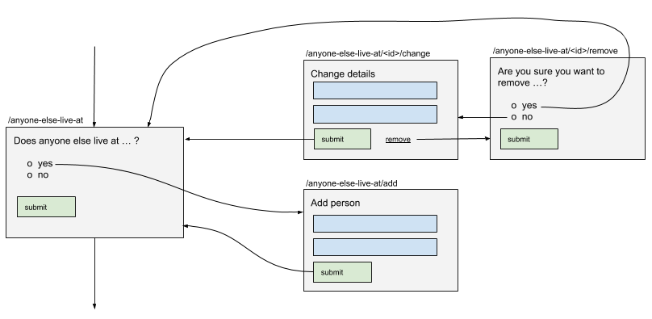

# 6. Make named lists a first class construct

## Context

The current approach to collecting a list of things e.g. people that live in a household, and asking questions for each thing in that list, is more complex than it needs to be.

Collecting a list of things is currently achieved using repeat until logic with a confirmation question to get out of the repeat - something like "Is this everyone that lives at ...?". While the happy path journey is acceptable, it soon falls apart when a user attempts to do something else, for example editing or removing a list item. This also means that every time we evaluate the routing path, we need to follow the list item entry and confirmation combination for every item in the list. Attempting to fit creation of a list of things into the standard question per block model is wrong, as the add/edit/remove journeys are not relevant outside of the list creation.

## Decision

- Define list creation in the schema
- Store lists and answers within the context of a list
- Remove all unnecessary repeat functionality

### Define list creation in the schema

A new block type will co-ordinate the collection of a list of things:

```json
{
    "id": "block-id",
    "type": "ListCollector",
    "for_list": "people",
    "question": {},
    "add_block": {},
    "edit_block": {},
    "remove_block": {}
}
```

- The routing path is kept simple as we can ignore the journeys taken adding/editing/removing when evaluating the path.
- Each add, edit and remove block will contain a Question block type.
- Each block can have variants. This is important as the add question can change depending on whether the list is empty or not.
- More than one list collector can populate the same list.

The user flows that will need to be implemented in runner from this schema:



### Store lists and answers within the context of a list

A new top level item in the questionnaire store will store each named list and it's identifiers:

```json
{
    "answers": [
        {
            "answer_id": "date-of-birth",
            "value": "1982-08-01",
            "list_item_id": "a9hd8j"
        },
        {
            "answer_id": "occupation",
            "value": "Teacher",
            "list_item_id": "a9hd8j"
        },
        {
            "answer_id": "date-of-birth",
            "value": "1994-02-05",
            "list_item_id": "kl9s3y"
        },
        {
            "answer_id": "occupation",
            "value": "Engineer",
            "list_item_id": "kl9s3y"
        }
    ],
    "lists": [
        {
            "name": "people",
            "items": [
                "a9hd8j",
                "kl9s3y"
            ]
        }
    ]
}
```

- Removal of `group_instance`, `group_instance_id` and `answer_instance` from answers.
- Introduction of a `list_item_id` that identifies the list item that an answer is related to.
- The order of the items in the list definiton will determine display order.
- The repeat identifier should be a short randomised string (it only has to be unique within the questionnaire).

### Remove all unnecessary repeat functionality

There are currently a number of ways to define a repeat that should be removed:

- `answer_value` provided a way of repeating based on a user provided value and is not used
- `answer_count` and `answer_count_minus_one` were only necessary in the absence of lists
- `until` was only ever used to collect a list

While we're simplifying the repeat logic, `repeat` should be moved out of `routing_rules`.

## Consequences

- Simpler routing and piping
- Clearer identification of related answers in the answer store.
- Repeats based on anything other than a list will not be possible.
