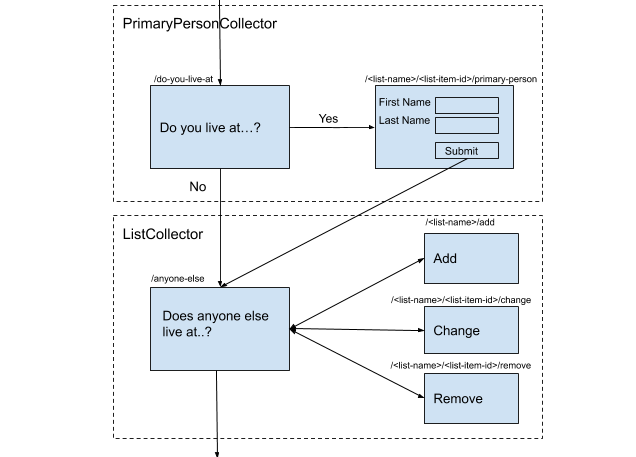
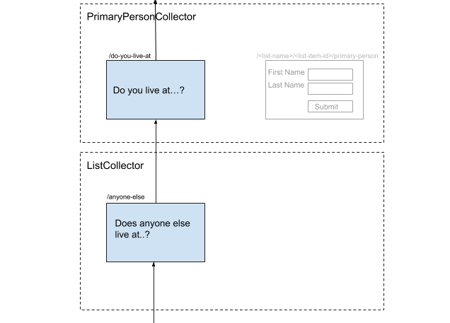

# 9. Primary Person

## Context

The census requires that the primary person within a household can be identified and routed differently than other household members. Currently all people within a household are represented as a list, with no distinction between them.

## Decision

### Add primary person attribute to lists

The list store will include a `primary_person` key which will map to a `list_item_id`. For example, a primary householder "Joe" would be represented as follows:

```json
{
    "answers": [
        {
            "answer_id": "date-of-birth",
            "value": "1982-08-01",
            "list_item_id": "a9hd8j"
        },
        {
            "answer_id": "first-name",
            "value": "Joe",
            "list_item_id": "a9hd8j"
        },
        {
            "answer_id": "date-of-birth",
            "value": "1990-05-23",
            "list_item_id": "gyt5hy"
        },
        {
            "answer_id": "first-name",
            "value": "Jane",
            "list_item_id": "gyt5hy"
        },
    ],
    "lists": [
        {
            "name": "people",
            "primary_person": "a9hd8j",
            "items": [
                "a9hd8j",
                "gyt5hy"
            ]
        }
    ]
}
```

### Create a PrimaryPersonCollector block type

A new block type "PrimaryPersonCollector" will be defined to support the necessary behaviour. It will extend the existing ListCollector and allow addition of a primary person through adding context to the list store. The following diagram identifies the flow to be implemented in runner.  



Both the PrimaryPersonListCollector and ListCollector operate upon the same list in the store. The PrimaryPersonCollector would create an item in the list store, before collecting any answers it refers to. This allows the identification of a primary person in one block and deferring their name entry to another. 

As per a ListCollector, the navigation path followed by the PrimaryPersonCollector exists separately from the main routing path. On routing backwards from the ListCollector, the primary person will be routed back to the driving question. This is represented in the reverse flow below, where the primary person would be unable to reach the primary name block when using the "Previous" link.



## Consequences

- The primary person is able to be represented as an attribute of the `ListStore`
- Custom handling of distinct block type allows addition and removal of primary person
- Both the primary person and other household persons entry do not form part of the main routing path
- Custom routing is able to be supported for primary person
